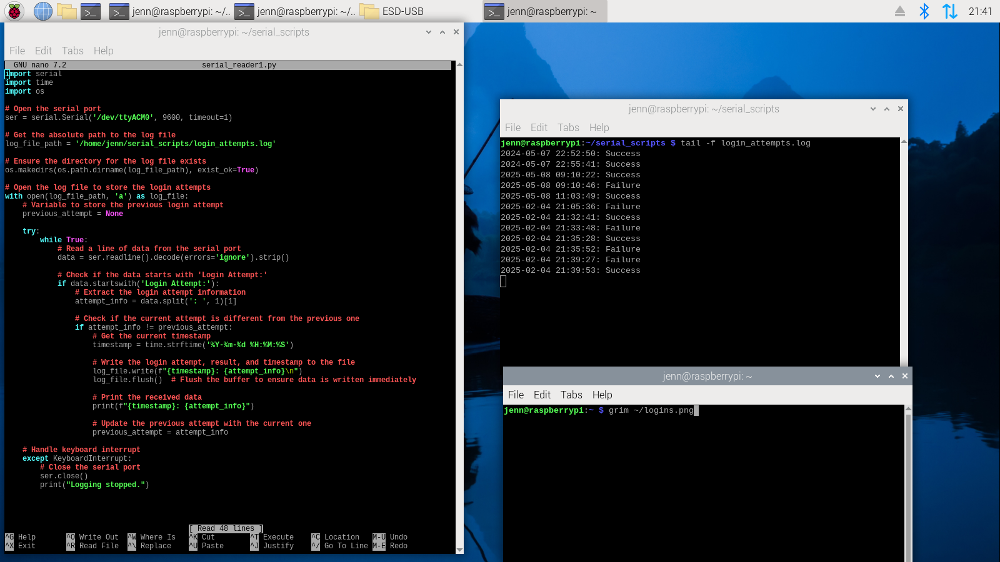

# arduino-rfid-lock
Star(duino)Wars RFID Lock with Multi-Factor Authentication
This project demonstrates a secure RFID lock system using **multi-factor authentication (MFA)**. It combines an RFID card scan with a 4-digit password to unlock a servo motor, simulating a door lock. The system provides interactive feedback using an LCD display, LEDs, and fun **Star Wars-themed melodies** for success and failure!

## Features
- **Multi-Factor Authentication**: Requires both an RFID card and a password for access.
- **Secure Password Storage**: Uses SHA-256 hashing to securely store passwords in EEPROM.
- **Interactive Feedback**:
  - LCD displays messages during operation.
  - LEDs indicate success (green) or failure (red).
  - Plays Star Wars melodies:
    - 🎵 Success: *Star Wars Main Theme*.
    - 🎵 Failure: *Imperial March*.
- **Integration with Raspberry Pi**: Logs login attempts via serial communication.

## 🌟Demo🌟

➡️[Watch Demo Video](https://drive.google.com/file/d/1FSMnjKZ0sPT7Wx7d6UZlmJyGW3ECMO5l/view?usp=sharing)⬅️ 
 

## Screenshots
### Raspberry Pi Logging Screen

## How It Works
1. **Scan an RFID Card**:
   - If the card matches the stored UID, the system prompts for a password.
   - If the card does not match, access is denied, and the failure melody plays.
2. **Enter a Password**:
   - If the password is correct, the servo motor unlocks, access is granted, and the success melody plays.
   - If incorrect, access is denied, and the failure melody plays.

## Hardware Used
- Arduino Uno
- MFRC522 RFID Reader Module
- 16x2 LCD Display (I2C)
- 4x4 Keypad
- SG90 Servo Motor
- LEDs (Green and Red)
- Buzzer

## Software Used
- Arduino IDE for programming.
- Raspberry Pi for logging login attempts via serial communication.

## Libraries Used
This project uses the following libraries:
1. [MFRC522](https://github.com/miguelbalboa/rfid) by Miguel Balboa  
   - Purpose: Interfacing with the RFID reader module.  
   - License: MIT License.

2. [LiquidCrystal_I2C](https://github.com/johnrickman/LiquidCrystal_I2C) by John Rickman  
   - Purpose: Controlling the 16x2 LCD display via I2C.  
   - License: MIT License.

3. [Keypad](https://playground.arduino.cc/Code/Keypad/) by Mark Stanley and Alexander Brevig  
   - Purpose: Interfacing with a 4x4 keypad.  
   - License: GNU General Public License v3 (GPLv3).

4. [Crypto (SHA256)](https://rweather.github.io/arduinolibs/crypto.html)  
   - Purpose: Provides SHA-256 hashing functionality for secure password storage.  
   - License: MIT License.

5. Pre-installed Arduino Libraries:
   - `Servo`: Controls the servo motor (SG90).  
   - `SPI`: Enables SPI communication with the RFID module.  
   - `Wire`: Enables I2C communication with the LCD display.  
   - `EEPROM`: Provides persistent storage for hashed passwords.

## Acknowledgments
- Portions of this code were generated with assistance from ChatGPT and Perplexity AI.
- The melodies used in this project were adapted from online Arduino projects featuring Star Wars themes.

## Future Improvements
Here are some ideas to enhance this project further:
1. Add support for multiple RFID cards with unique passwords.
2. Implement an admin mode to reset or change passwords via an admin card.

## License
This project is licensed under the GNU General Public License v3 (GPLv3).  
See the [LICENSE](LICENSE) file for details.
